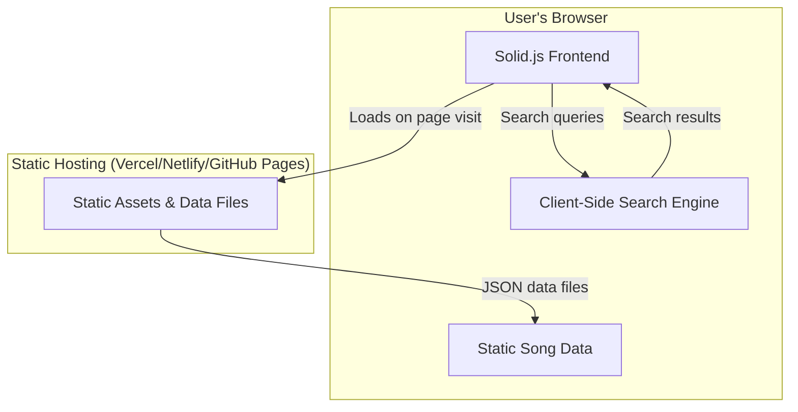

### Project Plan: Karaoke Song Search Website

This plan outlines the major phases and steps to build a feature-rich, fast, and user-friendly **client-only** website for searching songs and viewing their details.

#### Architecture Overview

The proposed architecture uses a modern client-side technology stack for a fast and lightweight application that runs entirely in the user's browser.



---

### Phase 1: Foundation & Data Setup

1.  **Technology Stack & Project Initialization**
    *   **Framework:** [Solid.js](https://www.solidjs.com/) with [Vite](https://vitejs.dev/) for fast development and building. This creates a highly performant, lightweight application with fine-grained reactivity.
    *   **Build Strategy:** Static Site Generation (SSG) using a custom build process with Vite to pre-generate static HTML files for all song pages at build time, without using Solid Start.
    *   **Search Engine:** [Fuse.js](https://fusejs.io/) will be used for client-side fuzzy search. It provides fast, flexible search across multiple fields like lyrics and titles without requiring a server.
    *   **Styling:** [UnoCSS](https://unocss.dev/) will be used for atomic CSS generation with better performance and flexibility than traditional CSS frameworks.
    *   **Routing:** [Solid Router](https://github.com/solidjs/solid-router) for client-side navigation between pages.

2.  **Data Modeling**
    *   We will define a clear structure for our song data. A single song document will look something like this:
        ```json
        {
          "id": "unique-song-id-123",
          "title_japanese": "夜に駆ける",
          "title_english": "Racing into the Night",
          "title_korean": "밤을 달리다",
          "artist": "YOASOBI",
          "pronunciation": "yoru ni kakeru",
          "lyrics": "沈むように溶けてゆくように...",
          "tj_id": "68321",
          "ky_id": "44629",
          "ebo_id": null,
          "joysound_id": "452935"
        }
        ```

3.  **Data Preparation & Integration**
    *   We will convert your song data (from JSON or CSV) into optimized static JSON files that can be loaded by the client.
    *   During the SSG build process, we will pre-generate individual HTML pages for each song to improve SEO and initial load performance.
    *   The data will be split into manageable chunks if needed to ensure fast loading times.
    *   We will set up Fuse.js with proper indexing configuration to search across `title`, `artist`, `pronunciation`, and `lyrics` fields.
    *   **Note:** You will need to provide the raw data for the songs.

4.  **Static Site Generation Setup**
    *   Create a custom build script that reads all song data and generates static HTML files for each song page (`/songs/[id].html`).
    *   Use Vite's build API to compile Solid.js components into static HTML with proper hydration.
    *   Configure UnoCSS to generate minimal, atomic CSS that only includes used styles.

### Phase 2: Client-Side Search Implementation

1.  **Search Service Setup**
    *   Create a search service that initializes Fuse.js with the song data on application startup.
    *   Configure search options for optimal performance and relevance (fuzzy matching, field weights, etc.).
    *   Implement search result ranking and filtering logic.

2.  **Data Loading Strategy**
    *   Implement efficient data loading that fetches song data when the app starts.
    *   Add loading states and error handling for data fetching.
    *   Consider implementing progressive loading for large datasets.

### Phase 3: Frontend UI/UX Development

1.  **Homepage / Search Page (`/`)**
    *   This page will feature a prominent search bar as the main interactive element.
    *   As the user types, it will perform real-time client-side search using Fuse.js and display results instantly.
    *   Each result will show the song title, artist, and karaoke IDs, and will link to the full detail page.
    *   Implement search suggestions and auto-complete functionality.

2.  **Song Detail Page (`/songs/[id]`)**
    *   A dedicated page for each song, created dynamically using Solid Router.
    *   It will display all the song's information in a clean, easy-to-read format, including all titles, full lyrics, and all available karaoke machine IDs.
    *   Add features like copy-to-clipboard for karaoke IDs and lyrics.

3.  **Performance Optimizations**
    *   Implement virtual scrolling for large result sets.
    *   Add debouncing for search input to improve performance.
    *   Use Solid.js's fine-grained reactivity and memoization features for optimal performance.

### Phase 4: Build & Deployment

1.  **Static Site Generation:** Run the custom build process to generate static HTML files for all pages, including individual song detail pages.
2.  **GitHub Actions Setup:** Configure a GitHub Actions workflow to automatically build and deploy the site when changes are pushed to the main branch.
3.  **Application Deployment:** The pre-generated static files (HTML, CSS, JS, JSON) will be deployed to [GitHub Pages](https://pages.github.com/) through the automated GitHub Actions pipeline.
4.  **Data Deployment:** The song data JSON files will be deployed alongside the application as static assets, eliminating the need for any server or database infrastructure.
5.  **Performance:** Pre-generated HTML provides instant page loads, while client-side search delivers instant results after the initial data load.

### Benefits of This Architecture

*   **Simplicity:** No server infrastructure needed - just static files
*   **Cost:** Free hosting on GitHub Pages with automated deployment via GitHub Actions
*   **Performance:** 
    *   Pre-generated HTML for instant page loads
    *   UnoCSS generates minimal, atomic CSS (smaller bundle sizes)
    *   Solid.js provides superior runtime performance vs traditional frameworks
    *   Instant search results after initial data load
*   **SEO:** Pre-generated HTML pages are fully indexable by search engines
*   **Reliability:** No server downtime concerns
*   **Offline Capability:** Can work offline once initially loaded
*   **Easy Deployment:** Simple build and deploy process
*   **Developer Experience:** UnoCSS provides better development ergonomics with on-demand CSS generation
